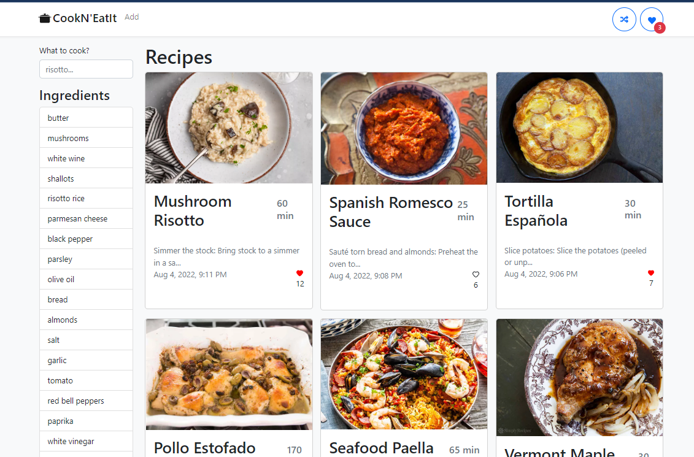

**Table of contents:**
- [Cook N' Eat It](#cook-n-eat-it)
  - [Introduction](#introduction)
  - [Project Start - Django Server](#project-start---django-server)
    - [Install Python and Git Bash](#install-python-and-git-bash)
    - [Create virtual environment](#create-virtual-environment)
    - [Install requirements](#install-requirements)
    - [Configure environment variables](#configure-environment-variables)
    - [Run the server](#run-the-server)
  - [Project Start - React Client](#project-start---react-client)
    - [Install node and npm](#install-node-and-npm)
    - [Install packages](#install-packages)
    - [Configure environment variables](#configure-environment-variables-1)
    - [Run the client](#run-the-client)
  - [Project commit structure](#project-commit-structure)

# Cook N' Eat It
A recipe sharing application using Django as a backend and React as a frontend.

## Introduction
The application allows users to create recipes and share them with other users.



Below, a list of functionalities anticipated in the application:
- React frontend
  - Create recipes
  - Filter by one specific ingredient
  - Filter by search term
  - Like recipes
  - Filter by liked recipes
  - Add images to recipes (in development)
- Django Backend
  - See all recipes (GET)
  - Create recipes (POST)
  - Delete specific recipe (DELETE)
  - Update specific recipe (PUT)
  - Upload images to cloudinary
  - Change amount of likes (PUT) (in development)
  - Change average rating (PUT) (in development)

## Project Start - Django Server

To run the project, it is necessary to:
- Install python and git bash.
- Create an activate virtual environment
- Install requirements
- Configure environment variables
- Run the server

### Install Python and Git Bash

Install [python 3]([https://www.python.org/downloads/](https://www.python.org/downloads/)).
Install [Git bash](https://git-scm.com/downloads).

Add python to path (if it isn’t already).

### Create virtual environment

Inside the project directory, create a server folder called `/server-django`.

Inside that folder, create a virtual environment called `venv.`

For Windows:

```bash
python -m venv venv
```

For Mac/Linux:

```bash
python3 -m venv venv
```

Activate virtual environment.

For windows, using git bash terminal:

```bash
source venv/Scripts/activate
```

For windows, on powershell:

```bash
.\venv\Script\activate
```

For Mac or Linux:

```bash
source venv/bin/activate
```

### Install requirements

In the root of the project, add a `requirements.txt` file with:

```
django>=4.0.0,<4.1.0
django-cloudinary-storage==0.3.0
django-cors-headers==3.13.0
django-environ==0.9.0
django-taggit==3.0.0
djangorestframework==3.13.1
asgiref==3.5.2
certifi==2022.6.15
charset-normalizer==2.1.0
cloudinary==1.29.0
Django==4.0.6
idna==3.3
Pillow==9.2.0
python-dotenv==0.20.0
pytz==2022.1
PyYAML==6.0
requests==2.28.1
six==1.16.0
sqlparse==0.4.2
tzdata==2022.1
urllib3==1.26.11

```

Django versions tend to change a lot with time. So it is important that we specify a version to avoid unwanted effects.

To install dependencies, run:

```bash
pip install -r requirements.txt
```

### Configure environment variables
For environmental variables there are cloudinary credentials and the secret key.
On a `.env` file, in the root of the django project, add the following:
```
CLOUDINARY_NAME="workspace_name"
CLOUDINARY_API_KEY="api_key"
CLOUDINARY_API_SECRET="api_secret" 
```

### Run the server

With the virtual environment activated, run the server:

```bash
python manage.py runserver
```

The application will be available at [http://localhost:8000/](http://localhost:8000/).

## Project Start - React Client
To run the client, it is necessary to:
- Install node and npm
- Install packages
- Configure environment variables
- Run the client

### Install node and npm
To download Node an NPM, visit [Node.js](https://nodejs.org/en/download/) and [npm](https://www.npmjs.com/get-npm).
With both tools added to the PATH, run the following command:

### Install packages
Inside the client-react folder, run the following command:

```bash
npm install
```

The project was bootstrapped by [vite](https://vite.netlify.com/) to improve development performance.

### Configure environment variables
No environment variables are necessary for the client.
### Run the client
Inside the client-react folder, run the following command:

```bash
npm run dev
```


## Project commit structure

Based on this FreeCodeCamp article:
[How to Write Better Git Commit Messages](https://www.freecodecamp.org/news/how-to-write-better-git-commit-messages/)

Structure:
 - `feat` – a new feature is introduced with the changes
 - `fix` – a bug fix has occurred
 - `chore` – changes that do not relate to a fix or feature and don't modify src or test files (for example updating dependencies)
 - `refactor` – refactored code that neither fixes a bug nor adds a feature
 - `docs` – updates to documentation such as a the README or other markdown files
 - `style` – changes that do not affect the meaning of the code, likely related to code formatting such as white-space, missing semi-colons, and so on.
 - `test` – including new or correcting previous tests
 - `perf` – performance improvements
 - `ci` – continuous integration related
 - `build` – changes that affect the build system or external dependencies
 - `revert` – reverts a previous commit
